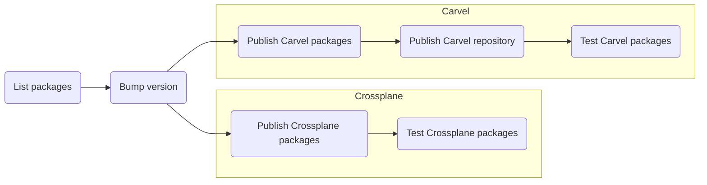

We store the code and configuration for the reference packages in the `packages` folder,
in a structure like the following:

```text
packages
├── <PROVIDER>
│   └── <PACKAGING>
│       └── <NAME>
│           ├── ...
│           ├── ...
┆           ┆
```

- `PROVIDER`:  the provider we build the package for (i.e., `aws`, `azure`, `gcp`, `multicloud`).
- `PACKAGING`: the packaging system used (currently, it must be either `carvel` or `crossplane`).
- `NAME`: the package name.

The following diagram shows that multiple packages can be built and tested in parallel via the `publish-packages.yml` workflow.



This workflow runs upon a push event to either `main` or `develop` branches and pull request events targeting the `main` branch.
Only the files matching the `packages/*/*/*/**` glob pattern trigger the workflow: this reflects the packages structure described before
and prevents changes to files outside actual package directories from triggering it.

## List packages

This job evaluates the differences since the previous commit and builds two lists of packages, for Carvel and Crossplane, to feed the following GitHub Actions matrix jobs.

## Bump version

The repository is tagged with a new version, bumping the latest one by either the major, minor, or patch fields.
The git comment determines which section of the version we increment. Depending on the occurrence of `#major,` `#minor`, `#patch` (default is  `patch`).
You can find more information [here](https://github.com/anothrNick/github-tag-action/tree/1.57.0).

## Publish Carvel packages

We build the changed Carvel packages in parallel and publish them to GitHub Packages using [Carvel's `kctrl`](https://carvel.dev/kapp-controller/docs/v0.43.2/kctrl-package-authoring/) CLI.
`kctrl` also produces package metadata files needed to build the Carvel repository. We store these metadata files in a separate (temporary) git branch for each package.

## Publish Carvel repository

We collect the packages' metadata files produced in the previous job into one branch. Finally, we use `kctrl` to author the pre-release Carvel repository and publish it to GitHub Packages in OCI format.
The artifact produced by `kctrl` is a manifest file for the `PackageRepository` resource, useful for quickly deploying the repository on top of a kapp-enabled Kubernetes cluster.
This file is attached to a pre-release; we use this file in the following job for testing the packages.

!!! Note "Carvel Repository"
    Because we build this Carvel repository to test the packages, we create a pre-release.
    The final repository release is taken care of by a different workflow.

## Test Carvel packages

This phase aims at testing the Carvel packages by spawning one (GitHub Workflow) job per package and running them in parallel on separate GitHub Actions runners.
Each job performs the following steps:

1. [install the Carvel suite](https://carvel.dev/#install)
1. create a [kind cluster](https://kind.sigs.k8s.io/)
1. [install kapp-controller](https://carvel.dev/kapp-controller/docs/v0.43.2/install/)
1. [install secretgen-controller](https://github.com/carvel-dev/secretgen-controller/blob/develop/docs/install.md)
1. install the Carvel repository published in the previous job
1. run a test script that adheres to a specific naming convention (`scripts/carvel-e2e-$PACKAGE_PROVIDER-$PACKAGE_NAME.sh`), to:

    1. install the cloud operator specific to the current package (i.e., [ACK](https://aws-controllers-k8s.github.io/community/docs/community/overview/), [ASO](https://azure.github.io/azure-service-operator/), ...)
    1. deploy the package with sample input data (need to consider also firewall rules to allow network traffic)
    1. deploy an application to consume the service provided via the package
    1. ingest data into the application
    1. assert the ingested data

1. clean up everything

## Publish Crossplane packages

We build Crossplane packages leveraging `ytt`, for dealing with templating, and the `up` CLI from Upbound, for building the packages and pushing them to an OCI registry (GitHub Packages).

## Test Crossplane packages

The test phase is similar to Carvel's, which means:

1. create a [kind cluster](https://kind.sigs.k8s.io/)
1. install [Upbound's Universal Crossplane](https://github.com/upbound/universal-crossplane)
1. run a test script that adheres to a specific naming convention (`scripts/crossplane-e2e-$PACKAGE_PROVIDER-$PACKAGE_NAME.sh`), to:

    1. install the Crossplane provider(s) needed by the package
    1. install the Crossplane package
    1. create a claim to trigger the build of the final managed resources
    1. deploy and test an application

1. clean up everything

!!! warning
    Testing Crossplane packages in standard GitHub Actions runners might be tricky:
    In fact, standard runners have two vCPUs and 7 GB of RAM at the time of writing (specs [here](https://docs.github.com/en/actions/using-github-hosted-runners/about-github-hosted-runners#supported-runners-and-hardware-resources)).
    This is on the low side for [serving the number of APIs](https://blog.upbound.io/scaling-kubernetes-to-thousands-of-crds/) that Crossplane and its providers can bring (especially the AWS one).
    Unfortunately, this leads to race conditions that might make the workflows either fail or succeed at unpredictable stages.

    However, it is possible to use the very same scripts provided and test the packages on a larger Kubernetes cluster
    or make use of **paid** [GitHub-hosted large runners](https://docs.github.com/en/actions/using-github-hosted-runners/using-larger-runners).
    Although standard Linux runners are free for public repositories, larger ones are not.
    However, you can look at the [per-minutes rates page](https://docs.github.com/en/billing/managing-billing-for-github-actions/about-billing-for-github-actions#per-minute-rates),
    to get an overview of the price of the various instances.
