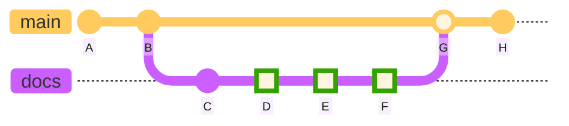

The current documentation is written using Markdown syntax and translated into static web pages
with [`mkdocs`](https://www.mkdocs.org/), which are then published to [GitHub Pages](https://pages.github.com/) and directly linked to the source code repository.

Via a single `mkdocs.yml` file it is possible to fine-tune `mkdocs`, its extensions and the theme of choice ([Material](https://squidfunk.github.io/mkdocs-material/)), thus creating very nice-looking and tidy pages.
The structure of the resulting website is defined in that file, too.

Depending on the specific git event, different workflows may be triggered
when docs files get added or updated inside the `docs` folder, or the `mkdocs.yml` file is changed.

Pull requests to the `main` branch trigger the `build-docs.yml` workflow, that does the build to validate the syntax.
In the following diagram, a pull request is created at commit `D`, and following commits on the same branch (`E` and `F`) cause pull request syncronize events.
All commits `D`, `E` and `F` trigger the `build-docs.yml` workflow.

When the pull request is accepted and the code gets merged to main (commit `G`),
the `publish-docs.yml` workflow builds and deploys the static website to GitHub Pages.

